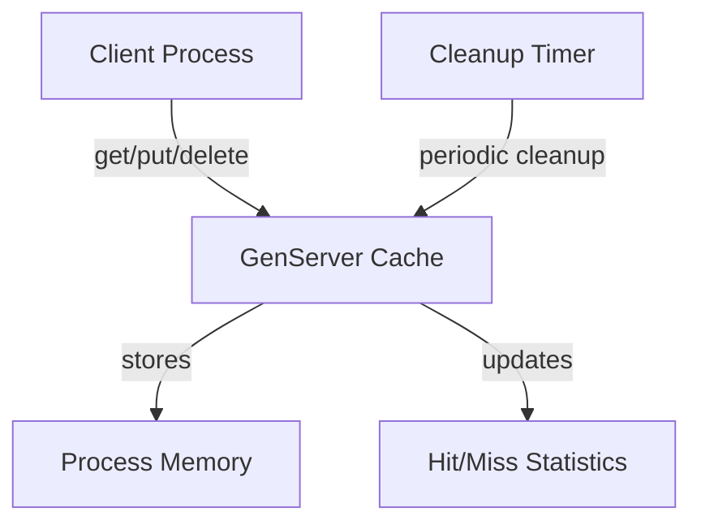

# GenServer Cache Pattern

## Overview

The GenServer Cache pattern implements an in-memory key-value store using a GenServer. This pattern is fundamental in Elixir applications where you need fast, process-local caching with additional features like TTL expiration and statistics tracking.

## Problem it Solves

- **Fast data access**: Store frequently accessed data in memory to avoid expensive I/O operations
- **TTL expiration**: Automatically expire cached data after a specified time
- **Statistics monitoring**: Track cache performance with hit/miss ratios
- **Process isolation**: Each cache instance runs in its own process, providing fault tolerance

## When to Use

✅ **Good for:**
- Session data storage
- API response caching
- Configuration caching
- Computed result memoization
- Rate limiting counters

❌ **Avoid when:**
- Data needs to persist beyond process restarts
- Cache needs to be shared across nodes (use distributed solutions like Cachex or Redis)
- Memory usage is a primary concern for large datasets
- You need complex cache invalidation strategies

## How It Works



The cache consists of:

1. **State Management**: GenServer maintains cache entries and statistics in its state
2. **TTL Handling**: Each entry can have an expiration timestamp
3. **Automatic Cleanup**: A periodic process removes expired entries
4. **Statistics Tracking**: Monitors hits, misses, and total key count

## Implementation Details

### Core Data Structures

```elixir
@type cache_entry :: {value(), expires_at :: integer() | nil}
@type state :: %{
  cache: %{key() => cache_entry()},
  stats: %{hits: non_neg_integer(), misses: non_neg_integer(), total_keys: non_neg_integer()},
  cleanup_interval: pos_integer()
}
```

### Key Features

1. **TTL Support**: Keys can expire after a specified time
2. **Lazy Expiration**: Expired keys are removed when accessed
3. **Periodic Cleanup**: Background process removes expired keys
4. **Statistics**: Tracks performance metrics
5. **Type Safety**: Full typespec coverage for all functions

## Usage Examples

### Basic Operations

```elixir
# Start the cache
{:ok, cache} = Patterns.GenServerCache.start_link()

# Store values
:ok = Patterns.GenServerCache.put(cache, "user:123", %{name: "John", role: "admin"})
:ok = Patterns.GenServerCache.put(cache, "session:abc", "active", 300_000)  # 5 minute TTL

# Retrieve values
{:ok, user} = Patterns.GenServerCache.get(cache, "user:123")
{:ok, "active"} = Patterns.GenServerCache.get(cache, "session:abc")

# Check statistics
%{hits: 2, misses: 0, total_keys: 2} = Patterns.GenServerCache.stats(cache)
```

### Configuration Caching Example

```elixir
defmodule MyApp.ConfigCache do
  use GenServer

  def start_link(opts) do
    GenServer.start_link(__MODULE__, opts, name: __MODULE__)
  end

  def get_config(key) do
    case Patterns.GenServerCache.get(__MODULE__, key) do
      {:ok, value} -> value
      :error ->
        value = fetch_from_database(key)
        Patterns.GenServerCache.put(__MODULE__, key, value, 600_000)  # 10 min TTL
        value
    end
  end

  defp fetch_from_database(key) do
    # Expensive database operation
    MyApp.Repo.get_config(key)
  end
end
```

### Try It Live in IEx

```bash
iex -S mix
```

```elixir
# Start a cache with custom cleanup interval
{:ok, cache} = Patterns.GenServerCache.start_link(cleanup_interval: 5000)

# Add some test data
Patterns.GenServerCache.put(cache, "temp", "data", 2000)  # 2 second TTL
Patterns.GenServerCache.put(cache, "permanent", "data")

# Check what's cached
Patterns.GenServerCache.keys(cache)
# ["temp", "permanent"]

# Wait and check again after expiration
:timer.sleep(3000)
Patterns.GenServerCache.keys(cache)
# ["permanent"] (temp may still be there until accessed or cleanup runs)

# Access the expired key to trigger removal
Patterns.GenServerCache.get(cache, "temp")
# :error

Patterns.GenServerCache.stats(cache)
# %{hits: 0, misses: 1, total_keys: 1}
```

## Real-World Usage

I've used this pattern extensively for:

1. **API Response Caching**: Cache external API responses with TTL to reduce API calls and improve response times
2. **User Session Storage**: Store user session data with automatic expiration for security
3. **Configuration Caching**: Cache database-stored configuration with periodic refresh
4. **Rate Limiting**: Track API usage per user/IP with rolling time windows

## Performance Characteristics

- **Memory Usage**: O(n) where n is number of cached items
- **Get/Put Operations**: O(1) average case
- **Cleanup**: O(n) but runs asynchronously
- **Concurrency**: Single GenServer handles all operations (potential bottleneck under high load)

## Alternatives and Extensions

- **ETS-based cache**: Better performance for read-heavy workloads
- **Cachex**: Production-ready caching library with advanced features
- **Distributed caching**: Use Redis or implement distributed consensus
- **Multiple GenServers**: Shard cache across multiple processes for better concurrency

## Best Practices

1. **Monitor memory usage**: Large caches can consume significant memory
2. **Choose appropriate TTL**: Balance freshness vs. performance
3. **Handle GenServer crashes**: Consider supervision strategy
4. **Use meaningful keys**: Avoid key collisions with proper namespacing
5. **Implement cache warming**: Pre-populate frequently accessed data

## Testing Strategy

The test suite covers:
- Basic CRUD operations
- TTL expiration behavior
- Statistics accuracy
- Concurrent access safety
- Edge cases and error conditions
- Automatic cleanup functionality

This demonstrates proper GenServer testing techniques including async tests, setup callbacks, and timing-dependent test scenarios.