# Supervisor Tree Pattern

## Overview

The Supervisor Tree pattern is fundamental to OTP (Open Telecom Platform) and demonstrates how to build fault-tolerant systems through process supervision. Supervisors monitor child processes and restart them when they fail, following the "let it crash" philosophy.

## Problem it Solves

- **Fault tolerance**: Automatically recover from process failures
- **System reliability**: Keep critical services running despite individual component failures
- **Error isolation**: Prevent cascading failures across the system
- **Process lifecycle management**: Handle starting, stopping, and restarting of child processes

## When to Use

✅ **Good for:**
- Managing long-running services (databases, HTTP servers, caches)
- Background job processors
- Stateful processes that need automatic recovery
- Systems requiring high availability
- Managing pools of worker processes

❌ **Avoid when:**
- Short-lived processes (use Task for simple async operations)
- Processes that should not restart (use `:temporary` restart strategy)
- Simple functional transformations (use plain functions)

## Supervision Strategies

### 1. One-for-One (`:one_for_one`)
Only the failed child is restarted. Other children continue running unaffected.

```mermaid
graph TB
    S[Supervisor] --> W1[Worker 1]
    S --> W2[Worker 2 ❌]
    S --> W3[Worker 3]
    W2 -.-> W2R[Worker 2 🔄]

    style W2 fill:#ff6b6b
    style W2R fill:#51cf66
```



**Use when:** Children are independent and failure of one doesn't affect others.

### 2. One-for-All (`:one_for_all`)
When any child fails, all children are terminated and restarted.

```mermaid
graph TB
    S[Supervisor] --> W1[Worker 1 ❌]
    S --> W2[Worker 2 ❌]
    S --> W3[Worker 3 ❌]
    W1 -.-> W1R[Worker 1 🔄]
    W2 -.-> W2R[Worker 2 🔄]
    W3 -.-> W3R[Worker 3 🔄]

    style W1 fill:#ff6b6b
    style W2 fill:#ff6b6b
    style W3 fill:#ff6b6b
    style W1R fill:#51cf66
    style W2R fill:#51cf66
    style W3R fill:#51cf66
```



**Use when:** Children depend on each other and need to restart together for consistency.

### 3. Rest-for-One (`:rest_for_one`)
The failed child and all children started after it are restarted.

```mermaid
graph TB
    S[Supervisor] --> W1[Worker 1 ✅]
    S --> W2[Worker 2 ❌]
    S --> W3[Worker 3 ❌]
    W2 -.-> W2R[Worker 2 🔄]
    W3 -.-> W3R[Worker 3 🔄]

    style W1 fill:#51cf66
    style W2 fill:#ff6b6b
    style W3 fill:#ff6b6b
    style W2R fill:#51cf66
    style W3R fill:#51cf66
```



**Use when:** Children have dependency relationships (later children depend on earlier ones).

## Restart Types

- **`:permanent`** - Always restart when child terminates
- **`:temporary`** - Never restart (for one-time tasks)
- **`:transient`** - Only restart if child terminates abnormally

## Implementation Details

### Child Specification

```elixir
%{
  id: :worker_1,                    # Unique identifier
  start: {DemoWorker, :start_link, [:worker_1]},  # {Module, Function, Args}
  restart: :permanent,              # Restart type
  type: :worker,                   # :worker or :supervisor
  shutdown: 5000                   # Shutdown timeout (optional)
}
```

### Supervision Tree Structure

```elixir
defmodule MyApp.Application do
  use Application

  def start(_type, _args) do
    children = [
      {MyApp.Cache, []},
      {MyApp.Database, []},
      {MyApp.WebServer, [port: 4000]}
    ]

    opts = [strategy: :one_for_one, name: MyApp.Supervisor]
    Supervisor.start_link(children, opts)
  end
end
```

## Usage Examples

### Basic Supervisor Setup

```elixir
# Start a supervisor with different strategies
{:ok, sup} = Patterns.SupervisorTree.start_link(:one_for_one)

# Inspect the supervisor
info = Patterns.SupervisorTree.info(sup)
%{
  strategy: :one_for_one,
  children: [%{id: :worker_1, alive?: true}, ...],
  running_count: 3,
  specs_count: 3
}
```

### Dynamic Child Management

```elixir
# Add a new worker at runtime
{:ok, worker_pid} = Patterns.SupervisorTree.add_child(sup, :worker, :dynamic_worker)

# Remove a worker
:ok = Patterns.SupervisorTree.remove_child(sup, :dynamic_worker)

# Restart a specific child
{:ok, new_pid} = Patterns.SupervisorTree.restart_child(sup, :worker_1)
```

### Testing Fault Tolerance

```elixir
# Get initial worker PIDs
info = Patterns.SupervisorTree.info(sup)
worker_1_pid = get_worker_pid(info.children, :worker_1)

# Crash a worker to test restart behavior
:ok = Patterns.SupervisorTree.crash_child(sup, :worker_1)

# Verify it was restarted
Process.sleep(50)
new_info = Patterns.SupervisorTree.info(sup)
new_worker_1_pid = get_worker_pid(new_info.children, :worker_1)

assert worker_1_pid != new_worker_1_pid  # New PID indicates restart
```

### Real-World Application Example

```elixir
defmodule MyApp.Supervisor do
  use Supervisor

  def start_link(opts) do
    Supervisor.start_link(__MODULE__, :ok, opts)
  end

  def init(:ok) do
    children = [
      # Database connection pool
      {MyApp.Repo, []},

      # Cache service (restart together if DB fails)
      %{
        id: MyApp.Cache,
        start: {MyApp.Cache, :start_link, []},
        restart: :permanent
      },

      # Background job processor
      {MyApp.JobProcessor, [concurrency: 10]},

      # Temporary health check (don't restart)
      %{
        id: MyApp.HealthCheck,
        start: {MyApp.HealthCheck, :start_link, []},
        restart: :temporary
      }
    ]

    # Database and cache should restart together if either fails
    Supervisor.init(children, strategy: :one_for_all)
  end
end
```

## Try It Live in IEx

```bash
iex -S mix
```

```elixir
# Start a supervisor with one-for-one strategy
{:ok, sup} = Patterns.SupervisorTree.start_link(:one_for_one)

# Check initial status
Patterns.SupervisorTree.info(sup)

# Test worker interaction
children = Supervisor.which_children(sup)
{:worker_1, pid, :worker, _} = List.keyfind(children, :worker_1, 0)
DemoWorker.ping(pid)  # => :pong

# Crash a worker and watch it restart
:ok = Patterns.SupervisorTree.crash_child(sup, :worker_1)
Process.sleep(100)

# Check that worker was restarted (new PID)
new_children = Supervisor.which_children(sup)
{:worker_1, new_pid, :worker, _} = List.keyfind(new_children, :worker_1, 0)
assert pid != new_pid

# Compare strategies
{:ok, sup_all} = Patterns.SupervisorTree.start_link(:one_for_all)
:ok = Patterns.SupervisorTree.crash_child(sup_all, :worker_1)
# Notice all children restart, not just :worker_1

Supervisor.stop(sup)
Supervisor.stop(sup_all)
```

## Real-World Usage

I've implemented supervision trees for:

1. **Microservice Architecture**: Each service as a supervised worker with health checks
2. **Data Processing Pipeline**: Stages as workers with `:rest_for_one` strategy for data flow dependencies
3. **WebSocket Connection Managers**: Each connection as a supervised process with automatic reconnection
4. **Background Job Systems**: Worker pools with supervisors managing job processors and dead letter queues

## Best Practices

1. **Design for Failure**: Assume processes will crash and design accordingly
2. **Keep State External**: Don't store critical state only in GenServer; use ETS, databases, or other persistent storage
3. **Choose Appropriate Strategies**: Match supervision strategy to your dependency requirements
4. **Limit Restart Frequency**: Set reasonable `max_restarts` and `max_seconds` to prevent restart loops
5. **Monitor Resource Usage**: Restarting processes can consume resources; monitor and alert
6. **Use Dynamic Supervisors**: For workers with unpredictable lifecycles (user sessions, temporary tasks)

## Testing Strategy

The test suite demonstrates:
- Supervisor initialization with different strategies
- Dynamic child management (add/remove)
- Fault tolerance behavior verification
- Worker interaction and state management
- Restart limit handling
- Process monitoring and introspection

## Performance Characteristics

- **Restart Overhead**: Each restart involves process creation and initialization
- **Memory Usage**: Each supervised process consumes memory for its state
- **Supervision Overhead**: Minimal - supervisors are lightweight
- **Cascading Restarts**: `:one_for_all` can cause significant restart overhead

## Common Patterns

### Dynamic Supervisor for Unknown Children

```elixir
{:ok, pid} = DynamicSupervisor.start_link(strategy: :one_for_one)
{:ok, child} = DynamicSupervisor.start_child(pid, {Worker, arg})
```

### Registry for Process Discovery

```elixir
# Combine with Registry for named process lookups
{:ok, _} = Registry.start_link(keys: :unique, name: MyRegistry)
{:ok, pid} = GenServer.start_link(Worker, arg, name: {:via, Registry, {MyRegistry, "worker_1"}})
```

### Nested Supervision Trees

```elixir
# Top-level application supervisor
children = [
  {DatabaseSupervisor, []},      # Manages DB connections
  {WebSupervisor, []},           # Manages web layer
  {JobSupervisor, []}            # Manages background jobs
]
```

This pattern is the foundation of robust Elixir applications, enabling the famous "9 nines" reliability through proper process supervision and fault recovery.