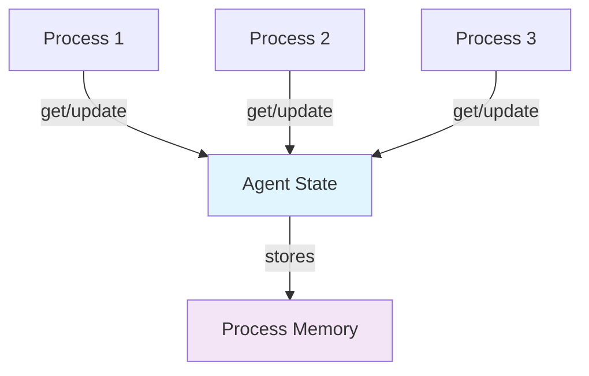

# Agent State Pattern

## Overview

The Agent pattern provides a simple abstraction for maintaining state in Elixir. Agents are built on top of GenServers but offer a much simpler API for basic state management scenarios. They're perfect for counters, configuration stores, caches, and other shared state that doesn't require complex business logic.

## Problem it Solves

- **Simple state storage**: Share state between processes without complex GenServer boilerplate
- **Atomic updates**: Ensure thread-safe state modifications
- **Configuration management**: Store and update runtime configuration
- **Metrics collection**: Track counters, statistics, and performance data
- **Caching**: Simple in-memory data storage with easy access patterns

## When to Use

✅ **Good for:**
- Counters and metrics
- Configuration storage
- Simple caches
- Application state that needs atomic updates
- Scenarios where you need shared mutable state but not complex message handling

❌ **Avoid when:**
- Complex business logic is required (use GenServer)
- You need message handling beyond get/update (use GenServer)
- State requires validation or complex transformations
- You need supervision strategies beyond basic restart (use GenServer with explicit supervision)

## How It Works



Agents provide three main operations:
- **`Agent.get/2`**: Read state without modification
- **`Agent.update/2`**: Modify state without returning a value
- **`Agent.get_and_update/2`**: Atomically read and modify state

## Implementation Patterns

### 1. Counter Pattern

Perfect for tracking metrics, request counts, or any incrementing values.

```elixir
defmodule Counter do
  def start_link(initial_count \\ 0) do
    Agent.start_link(fn -> initial_count end)
  end

  def get(counter) do
    Agent.get(counter, & &1)
  end

  def increment(counter) do
    Agent.get_and_update(counter, fn count ->
      new_count = count + 1
      {new_count, new_count}  # Return {value_to_return, new_state}
    end)
  end
end
```

### 2. Configuration Store Pattern

Ideal for runtime configuration that can be updated dynamically.

```elixir
defmodule ConfigStore do
  def start_link(initial_config \\ %{}) do
    Agent.start_link(fn -> initial_config end)
  end

  def get(store, key, default \\ nil) do
    Agent.get(store, &Map.get(&1, key, default))
  end

  def put(store, key, value) do
    Agent.update(store, &Map.put(&1, key, value))
  end
end
```

### 3. Statistics Collector Pattern

Great for collecting application metrics and performance data.

```elixir
defmodule Statistics do
  def start_link do
    Agent.start_link(fn -> %{} end)
  end

  def increment(stats, metric) do
    Agent.update(stats, &Map.update(&1, metric, 1, fn x -> x + 1 end))
  end

  def time(stats, metric, fun) do
    start_time = System.monotonic_time(:millisecond)
    result = fun.()
    duration = System.monotonic_time(:millisecond) - start_time

    Agent.update(stats, fn current ->
      current
      |> Map.update(:"#{metric}_total_ms", duration, &(&1 + duration))
      |> Map.update(:"#{metric}_count", 1, &(&1 + 1))
    end)

    result
  end
end
```

## Usage Examples

### Basic Counter Usage

```elixir
# Start a counter
{:ok, counter} = Patterns.AgentState.Counter.start_link(0)

# Use it
Patterns.AgentState.Counter.increment(counter)  # => 1
Patterns.AgentState.Counter.increment(counter)  # => 2
Patterns.AgentState.Counter.add(counter, 5)     # => 7
Patterns.AgentState.Counter.get(counter)        # => 7

# Reset when needed
Patterns.AgentState.Counter.reset(counter)      # => 7 (returns old value)
Patterns.AgentState.Counter.get(counter)        # => 0
```

### Configuration Management

```elixir
# Start with default config
{:ok, config} = Patterns.AgentState.ConfigStore.start_link(%{
  database_url: "localhost:5432",
  pool_size: 10,
  timeout: 5000
})

# Read configuration
db_url = Patterns.AgentState.ConfigStore.get(config, :database_url)
pool_size = Patterns.AgentState.ConfigStore.get(config, :pool_size, 5)

# Update configuration at runtime
Patterns.AgentState.ConfigStore.put(config, :pool_size, 20)

# Merge in new configuration
Patterns.AgentState.ConfigStore.merge(config, %{
  new_feature_enabled: true,
  cache_ttl: 300
})
```

### Statistics Collection

```elixir
{:ok, stats} = Patterns.AgentState.Statistics.start_link()

# Track simple metrics
Patterns.AgentState.Statistics.increment(stats, :page_views)
Patterns.AgentState.Statistics.add(stats, :bytes_transferred, 1024)

# Time operations
result = Patterns.AgentState.Statistics.time(stats, :database_query, fn ->
  # Simulate database work
  Process.sleep(10)
  {:ok, "query result"}
end)

# Get average timing
avg_time = Patterns.AgentState.Statistics.average_time(stats, :database_query)
# => 10.5 (milliseconds)
```

### Real-World Application Example

```elixir
defmodule MyApp.Metrics do
  alias Patterns.AgentState.{Counter, Statistics}

  def start_link do
    children = [
      {Counter, [name: :request_counter]},
      {Counter, [name: :error_counter]},
      {Statistics, [name: :app_stats]}
    ]

    Supervisor.start_link(children, strategy: :one_for_one)
  end

  def record_request do
    Counter.increment(:request_counter)
  end

  def record_error do
    Counter.increment(:error_counter)
  end

  def time_operation(operation_name, fun) do
    Statistics.time(:app_stats, operation_name, fun)
  end

  def get_summary do
    %{
      total_requests: Counter.get(:request_counter),
      total_errors: Counter.get(:error_counter),
      error_rate: calculate_error_rate(),
      stats: Statistics.get_all(:app_stats)
    }
  end

  defp calculate_error_rate do
    requests = Counter.get(:request_counter)
    errors = Counter.get(:error_counter)

    if requests > 0 do
      (errors / requests) * 100
    else
      0.0
    end
  end
end
```

## Try It Live in IEx

```bash
iex -S mix
```

```elixir
# Counter operations
{:ok, counter} = Patterns.AgentState.Counter.start_link(10)
Patterns.AgentState.Counter.get(counter)        # => 10
Patterns.AgentState.Counter.increment(counter)  # => 11
Patterns.AgentState.Counter.add(counter, -5)    # => 6

# Configuration store
{:ok, config} = Patterns.AgentState.ConfigStore.start_link(%{debug: true})
Patterns.AgentState.ConfigStore.get(config, :debug)           # => true
Patterns.AgentState.ConfigStore.put(config, :timeout, 1000)   # => nil
Patterns.AgentState.ConfigStore.keys(config)                  # => [:debug, :timeout]

# Statistics collection
{:ok, stats} = Patterns.AgentState.Statistics.start_link()
Patterns.AgentState.Statistics.time(stats, :test, fn ->
  Process.sleep(100)
  "done"
end)
# => "done"

Patterns.AgentState.Statistics.average_time(stats, :test)     # => ~100.0

# Concurrent safety demonstration
for _i <- 1..100, do: spawn(fn ->
  Patterns.AgentState.Counter.increment(counter)
end)

Process.sleep(100)
Patterns.AgentState.Counter.get(counter)  # => 106 (exactly 6 + 100)
```

## Real-World Usage

I've used Agent patterns for:

1. **Request Rate Limiting**: Track requests per user/IP with time windows
2. **Feature Flag Management**: Runtime configuration for A/B testing
3. **Application Metrics**: Performance monitoring and health checks
4. **Cache Warming**: Simple in-memory caches for frequently accessed data
5. **User Session Counters**: Track active sessions and user activity

## Performance Characteristics

- **Memory Usage**: O(1) per agent + size of stored state
- **Concurrency**: Single process handles all requests (potential bottleneck)
- **Operations**: O(1) for simple get/update operations
- **Overhead**: Minimal - agents are lightweight GenServers

## Advantages over GenServer

1. **Simplicity**: Much less boilerplate code
2. **Focused**: Designed specifically for state management
3. **Atomic Operations**: Built-in support for `get_and_update`
4. **Less Error-Prone**: Fewer callbacks to implement incorrectly

## Limitations

1. **No Message Handling**: Can't receive arbitrary messages
2. **No Complex Logic**: Limited to get/update operations
3. **Single Process**: No built-in load distribution
4. **No Timeouts**: Can't implement call timeouts easily

## Best Practices

1. **Keep State Simple**: Use Maps, lists, and basic data structures
2. **Avoid Heavy Computations**: Don't do expensive work in update functions
3. **Use Appropriate Names**: Name your agents clearly (`:user_counter`, `:app_config`)
4. **Consider ETS for High-Frequency Reads**: Agents serialize all access
5. **Supervise Properly**: Include agents in your supervision tree
6. **Handle Failures**: Design for agent restarts (state will be lost)

## Testing Strategy

The test suite demonstrates:
- Basic state operations (get/set/update)
- Atomic operations and race condition safety
- Concurrent access patterns
- Integration scenarios
- Error handling and edge cases
- Performance characteristics

## When to Graduate to GenServer

Consider moving from Agent to GenServer when you need:
- Custom message handling
- Complex business logic
- Call timeouts
- Structured error handling
- Process hibernation
- Custom termination logic

## Alternatives

- **ETS**: For high-read, low-write scenarios
- **GenServer**: For complex state management
- **Persistent Term**: For read-only global state
- **Process Dictionary**: For process-local state (use sparingly)

The Agent pattern strikes the perfect balance between simplicity and functionality for most basic state management needs in Elixir applications.