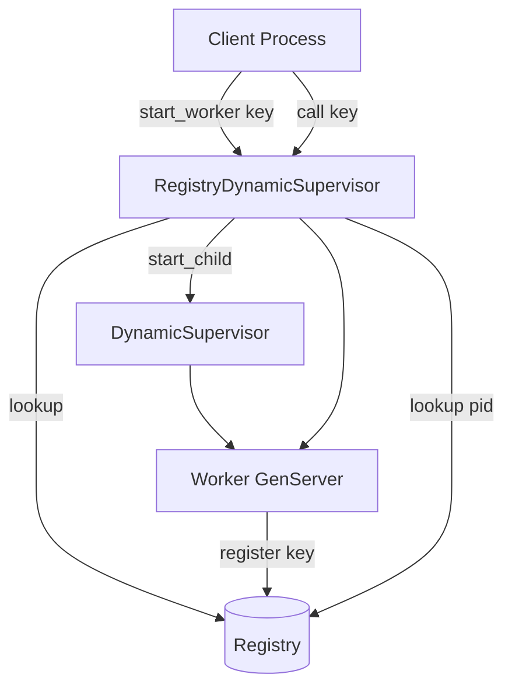

# Registry & Dynamic Supervisors Pattern

## Overview

The Registry and DynamicSupervisor pattern is the standard OTP approach for managing a dynamic pool of named processes at runtime. A `Registry` maps unique keys to process IDs, while a `DynamicSupervisor` starts and stops workers on demand.

This is how Elixir applications model one-process-per-resource scenarios: chat rooms, WebSocket connections, per-tenant workers, shard coordinators, and session handlers.

## Problem it Solves

- **Runtime process creation**: Start workers only when needed, not at boot
- **Unique naming**: Look up a process by a business key (`"user:123"`, `"room:lobby"`)
- **Idempotent access**: Safely call `start_worker/2` from many callers — only one process runs per key
- **Automatic recovery**: Crashed workers restart under supervision and re-register
- **Clean teardown**: Stop individual workers without restarting the whole application

## When to Use

✅ **Good for:**

- One GenServer per WebSocket connection or channel
- Per-user or per-tenant background workers
- Game rooms, chat channels, or collaborative sessions
- Sharded workers keyed by ID or hash
- Any "find or start" process lookup

❌ **Avoid when:**

- You need a fixed pool size at boot (use a static supervisor or pool)
- Keys are not unique (use `Registry` with `keys: :duplicate` instead)
- Processes are short-lived fire-and-forget tasks (use `Task.Supervisor`)
- You only need global singletons (use a named GenServer)

## How It Works



### Component Roles

| Component | Responsibility |
|-----------|----------------|
| **Registry** | Maps unique keys to pids for fast lookup |
| **DynamicSupervisor** | Starts, stops, and restarts workers on demand |
| **Worker** | Registers its key in `init/1` and handles business logic |

## Implementation

### Supervisor Tree

```elixir
children = [
  {Registry, keys: :unique, name: MyApp.WorkerRegistry},
  {DynamicSupervisor, name: MyApp.DynamicSupervisor, strategy: :one_for_one}
]

Supervisor.init(children, strategy: :one_for_one)
```

### Worker Registration

Workers register themselves during initialization:

```elixir
def init({key, registry, _dynamic}) do
  Registry.register(registry, key, %{started_at: System.monotonic_time(:millisecond)})
  {:ok, %{key: key, calls: 0}}
end
```

### Idempotent Start

Always check the registry before starting a new child:

```elixir
case Registry.lookup(registry, key) do
  [{pid, _}] -> {:ok, pid}
  [] -> DynamicSupervisor.start_child(dynamic, {Worker, key})
end
```

## Usage Examples

### Basic Lifecycle

```elixir
{:ok, sup} = Patterns.RegistryDynamicSupervisor.start()

# Start on demand
{:ok, worker} = Patterns.RegistryDynamicSupervisor.start_worker(sup, "room:lobby")

# Lookup without starting
{:ok, ^worker} = Patterns.RegistryDynamicSupervisor.lookup(sup, "room:lobby")

# Stop when done
:ok = Patterns.RegistryDynamicSupervisor.stop_worker(sup, "room:lobby")
```

### Call by Key

The API can start a worker if it does not exist yet:

```elixir
:pong = Patterns.RegistryDynamicSupervisor.call(sup, "user:42", :ping)
:ok = Patterns.RegistryDynamicSupervisor.cast(sup, "user:42", {:set, %{theme: "dark"}})
{:ok, %{theme: "dark"}} = Patterns.RegistryDynamicSupervisor.call(sup, "user:42", :get)
```

### Introspection

```elixir
info = Patterns.RegistryDynamicSupervisor.info(sup)
# %{
#   registry: Patterns.RegistryDynamicSupervisor.Registry.123,
#   dynamic_supervisor: Patterns.RegistryDynamicSupervisor.DynamicSupervisor.123,
#   worker_count: 2,
#   workers: [...]
# }
```

## Real-World Applications

### Phoenix Channels / LiveView

Each channel topic or presence shard often maps to a keyed process:

```elixir
def get_room_pid(room_id) do
  Patterns.RegistryDynamicSupervisor.start_worker(RoomSupervisor, "room:#{room_id}")
end
```

### Multi-Tenant Workers

Isolate tenant-specific state in dedicated processes:

```elixir
Patterns.RegistryDynamicSupervisor.call(TenantSupervisor, tenant_id, {:process_event, event})
```

### Connection Handlers

One process per WebSocket connection, registered by connection ID:

```elixir
Patterns.RegistryDynamicSupervisor.start_worker(ConnectionSupervisor, conn_id)
```

## Supervision Considerations

### Restart Strategy

Use `:transient` for workers that should restart only on abnormal exit:

```elixir
%{
  id: key,
  start: {Worker, :start_link, [key, registry]},
  restart: :transient
}
```

- **`:temporary`**: Never restart (good for one-off jobs)
- **`:transient`**: Restart on abnormal exit (typical for stateful workers)
- **`:permanent`**: Always restart (rare for dynamic workers)

### Registry Cleanup

When a worker dies, the Registry automatically removes its entry. On restart, the worker re-registers in `init/1`. Callers using `start_worker/2` remain safe.

### Graceful Shutdown

Stop workers explicitly when the resource is no longer needed:

```elixir
Patterns.RegistryDynamicSupervisor.stop_worker(sup, "session:expired")
```

This prevents unbounded process growth in long-running systems.

## Comparison with Related Patterns

| Pattern | Use Case |
|---------|----------|
| **Registry + DynamicSupervisor** | One process per unique key, started on demand |
| **Supervisor Tree** (Phase 1) | Fixed set of children known at boot |
| **Agent State** (Phase 1) | Simple shared state without keyed lookup |
| **Process Pool** (Phase 2, coming) | Fixed pool of interchangeable workers |

## Performance Characteristics

- **Registry lookup**: O(1) for unique keys — very fast
- **Start overhead**: One DynamicSupervisor call per new key
- **Memory**: One process per active key — monitor process count
- **Contention**: Unique registry keys avoid duplicate workers for the same resource

## Testing Tips

1. Use `start/0` (unlinked) in tests to avoid polluting the application supervision tree
2. Always stop the supervisor in `on_exit` callbacks
3. Test idempotent `start_worker/2` — concurrent callers should get the same pid
4. Test crash recovery — verify lookup returns a new pid after intentional crash

## Key Takeaways

1. **Registry for lookup, DynamicSupervisor for lifecycle** — they solve different problems and work best together
2. **Register in `init/1`** — ensures the key is available as soon as the worker is alive
3. **Make starts idempotent** — production code often races to start the same keyed process
4. **Stop workers you no longer need** — dynamic systems need explicit teardown to stay healthy
5. **Choose restart strategy deliberately** — `:transient` is the default for most stateful keyed workers

## Next in Phase 2

- **Pub/Sub with Registry** — broadcast events to keyed subscribers
- **Process Pooling** — fixed-size worker pools for interchangeable jobs
- **Circuit Breaker** — protect external calls from cascading failures
