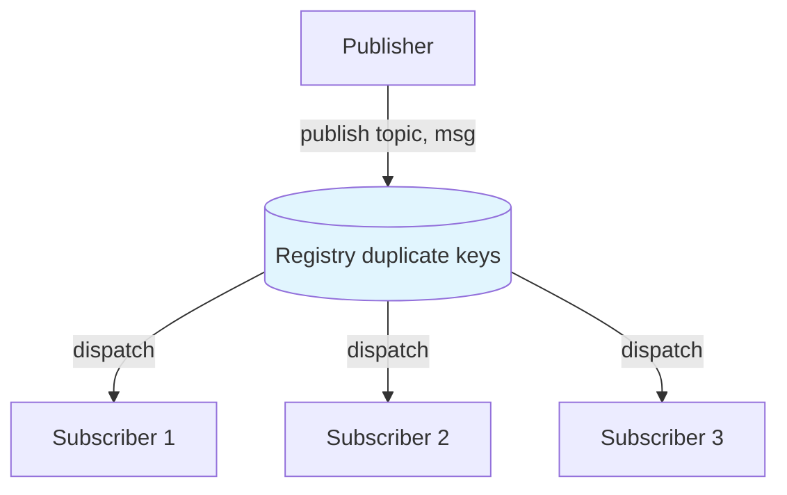

# Pub/Sub with Registry Pattern

## Overview

The Pub/Sub with Registry pattern uses Elixir's built-in `Registry` with duplicate keys to implement topic-based event distribution. Multiple subscribers can listen to the same topic, and publishers fan out messages without knowing individual subscriber identities.

This is a lightweight alternative to dedicated pub/sub libraries like Phoenix PubSub — ideal for in-process event buses within a single BEAM node.

## Problem it Solves

- **Decoupled communication**: Publishers and subscribers interact through topics, not direct pids
- **Multiple listeners**: Many processes can subscribe to the same topic simultaneously
- **Dynamic membership**: Subscribers join and leave at runtime without central coordination
- **Automatic cleanup**: Dead subscribers are removed from the registry automatically
- **Fast fan-out**: `Registry.dispatch/3` efficiently delivers to all matching processes

## When to Use

✅ **Good for:**

- In-process domain event buses
- Notifying multiple services of state changes within one node
- Decoupling GenServers in a monolithic or umbrella application
- Prototyping event-driven flows before adopting Phoenix PubSub
- Topic-based notifications (`"user:123:updates"`, `"orders.created"`)

❌ **Avoid when:**

- You need cross-node distribution (use Phoenix PubSub or `:pg`)
- Messages must be persisted or replayed (use a message queue)
- Guaranteed delivery is required (Registry dispatch is fire-and-forget)
- You need backpressure or rate limiting on subscribers

## How It Works



### Key Difference from Phase 2 Part 1

| Pattern | Registry Keys | Purpose |
|---------|---------------|---------|
| **Registry & Dynamic Supervisors** | `:unique` | One process per key |
| **Pub/Sub with Registry** | `:duplicate` | Many subscribers per topic |

## Implementation

### Duplicate-Key Registry

```elixir
{Registry, keys: :duplicate, name: MyApp.PubSubRegistry}
```

With duplicate keys, many processes can register under `"orders.created"`.

### Subscribe

Each subscriber registers itself from its own process:

```elixir
def subscribe(supervisor, topic) do
  %{registry: registry} = components(supervisor)
  Registry.register(registry, topic, %{subscribed_at: monotonic_time()})
  :ok
end
```

### Publish with Dispatch

```elixir
def publish(supervisor, topic, message) do
  Registry.dispatch(registry, topic, fn entries ->
    for {pid, _meta} <- entries, do: send(pid, {:pubsub, topic, message})
  end)
end
```

`Registry.dispatch/3` runs the callback while holding a lock on the key partition, preventing race conditions during fan-out.

### Unsubscribe

```elixir
Registry.unregister_match(registry, topic, subscriber_pid)
```

## Usage Examples

### Basic Pub/Sub

```elixir
{:ok, sup} = Patterns.RegistryPubSub.start()

# Subscribe from the calling process
:ok = Patterns.RegistryPubSub.subscribe(sup, "orders.created")

# Publish to all subscribers
{:ok, 1} = Patterns.RegistryPubSub.publish(sup, "orders.created", %{id: 42})

# Receive in subscriber process
receive do
  {:pubsub, "orders.created", %{id: 42}} -> :ok
end
```

### Multiple Subscribers

```elixir
{:ok, billing} = Patterns.RegistryPubSub.Subscriber.start_link(sup, "orders.created")
{:ok, analytics} = Patterns.RegistryPubSub.Subscriber.start_link(sup, "orders.created")

{:ok, 2} = Patterns.RegistryPubSub.publish(sup, "orders.created", %{total: 99})

Patterns.RegistryPubSub.Subscriber.messages(billing)
# [{"orders.created", %{total: 99}}]
```

### Introspection

```elixir
Patterns.RegistryPubSub.info(sup)
# %{
#   registry: Patterns.RegistryPubSub.Registry.123,
#   topic_count: 2,
#   subscriber_count: 3,
#   topics: [{"orders.created", 2}, {"inventory.low", 1}]
# }
```

## Real-World Applications

### Domain Events

Publish business events after successful transactions:

```elixir
{:ok, _} = RegistryPubSub.publish(sup, "orders.created", order)
# Billing, analytics, and notification services react independently
```

### Cache Invalidation

Multiple cache layers subscribe to invalidation topics:

```elixir
RegistryPubSub.publish(sup, "cache:users:123", :invalidate)
```

### Live UI Updates

GenServers representing UI state subscribe to entity-specific topics:

```elixir
RegistryPubSub.subscribe(sup, "project:#{project_id}")
```

## Message Contract

Subscribers receive a consistent tuple:

```elixir
{:pubsub, topic, payload}
```

Define a shared module for topic names to avoid typos:

```elixir
defmodule MyApp.Topics do
  def order_created, do: "orders.created"
  def user_updated(user_id), do: "users.updated:#{user_id}"
end
```

## Supervision Considerations

### Registry Lifecycle

The Registry is started as a supervisor child. When the supervisor stops, all subscriptions are cleared.

### Subscriber Crashes

When a subscriber process exits, the Registry automatically removes its registration. No manual cleanup is required.

### Re-subscription on Restart

If a supervised subscriber restarts, it must call `subscribe/2` again in its `init/1` callback — registration does not survive process restarts.

## Comparison with Phoenix PubSub

| Feature | Registry Pub/Sub | Phoenix PubSub |
|---------|------------------|----------------|
| Scope | Single node | Local + cluster |
| Persistence | None | None |
| Dependencies | OTP only | Phoenix |
| Performance | Excellent in-process | Optimized for Phoenix |
| Cross-node | No | Yes |

Use Registry Pub/Sub for learning and single-node decoupling. Reach for Phoenix PubSub when you need distributed broadcasts.

## Testing Tips

1. Use `start/0` (unlinked) in tests to isolate from the application tree
2. The included `Subscriber` GenServer collects messages for easy assertions
3. Test fan-out by spawning multiple subscriber processes
4. Verify automatic unregistration by killing a subscriber and checking counts
5. Always unsubscribe or stop the supervisor in `on_exit` callbacks

## Key Takeaways

1. **Duplicate keys enable many subscribers per topic** — the core difference from unique-key registries
2. **`Registry.dispatch/3` is the publish mechanism** — it safely iterates all subscribers under a key
3. **Subscribers must register from their own process** — `Registry.register/3` always registers `self()`
4. **Fire-and-forget semantics** — no delivery guarantees; design subscribers to tolerate missed messages or add ack patterns
5. **Automatic cleanup on crash** — but supervised restarts require re-subscription

## Next in Phase 2

- **Process Pooling** — fixed-size worker pools for interchangeable jobs
- **Circuit Breaker** — protect external calls from cascading failures
