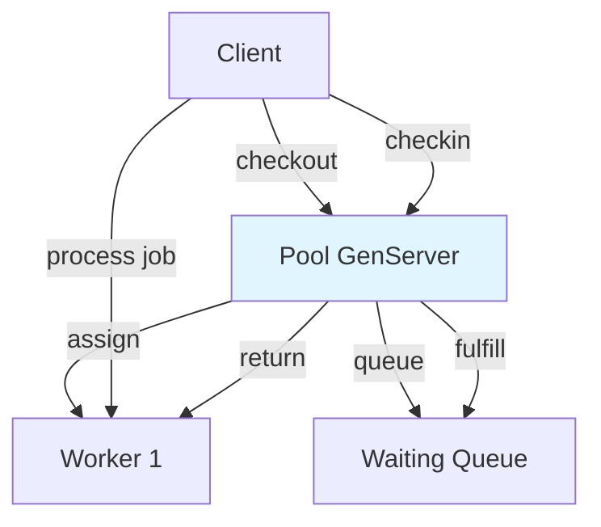

# Process Pooling Pattern

## Overview

The Process Pooling pattern maintains a fixed set of pre-started worker processes that handle interchangeable jobs. Instead of spawning a new process per request, callers check out an existing worker, run work, and return it to the pool.

This is the core idea behind libraries like [Poolboy](https://github.com/devinus/poolboy) — and a fundamental tool for controlling concurrency and resource usage in OTP applications.

## Problem it Solves

- **Bounded concurrency**: Limit simultaneous work to pool size
- **Reduced startup cost**: Workers are pre-warmed at boot
- **Resource control**: Cap connections, file handles, or CPU-bound workers
- **Fair scheduling**: Waiting callers queue when the pool is exhausted
- **Fault recovery**: Crashed workers are replaced without restarting the pool

## When to Use

✅ **Good for:**

- Database connection pools
- HTTP client pools to external APIs
- CPU-bound worker pools with fixed parallelism
- Expensive-to-start processes reused across requests
- Rate-limiting concurrent access to a scarce resource

❌ **Avoid when:**

- Each job needs dedicated long-lived state (use Registry + DynamicSupervisor)
- Work is fire-and-forget (use `Task.Supervisor`)
- You need one process per unique key (use keyed Registry pattern)
- Pool size would always be 1 (use a single GenServer)

## How It Works



### Core Components

| Component | Role |
|-----------|------|
| **Pool GenServer** | Tracks available, in-use, and waiting callers |
| **Worker GenServer** | Processes interchangeable jobs |
| **Supervisor** | Starts and supervises the pool |

## Implementation

### Pool State

```elixir
%{
  size: 5,
  available: :queue.new(),      # idle workers
  in_use: %{pid => %{from: from}},  # checked-out workers
  waiting: :queue.new()          # blocked checkout requests
}
```

### Checkout

When a worker is available, assign it immediately. Otherwise, queue the caller with a timeout timer:

```elixir
case :queue.out(state.available) do
  {{:value, worker}, rest} ->
    {:reply, {:ok, worker}, mark_in_use(state, worker, from)}

  {:empty, _} ->
    timer = Process.send_after(self(), {:checkout_timeout, ref, from}, timeout)
    {:noreply, enqueue_waiting(state, from, ref, timer)}
end
```

### Checkin

Return the worker to the available queue, then fulfill the next waiting caller if any:

```elixir
defp return_worker(state, worker) do
  state
  |> pop_in_use(worker)
  |> enqueue_available(worker)
  |> fulfill_waiting()
end
```

### Transaction

Guarantee checkin even when work fails:

```elixir
def transaction(pool, fun, timeout) do
  with {:ok, worker} <- checkout(pool, timeout) do
    try do
      {:ok, fun.(worker)}
    after
      checkin(pool, worker)
    end
  end
end
```

## Usage Examples

### Simple Processing

```elixir
{:ok, pool} = Patterns.ProcessPool.start(size: 4)

{:ok, result} = Patterns.ProcessPool.process(pool, {:add, 10, 20})
# 30
```

### Manual Checkout/Checkin

```elixir
{:ok, worker} = Patterns.ProcessPool.checkout(pool)
try do
  Patterns.ProcessPool.Worker.process(worker, {:echo, "data"})
after
  Patterns.ProcessPool.checkin(pool, worker)
end
```

### Transaction

```elixir
{:ok, data} =
  Patterns.ProcessPool.transaction(pool, fn worker ->
    Patterns.ProcessPool.Worker.process(worker, {:delay, 100})
  end)
```

### Pool Introspection

```elixir
Patterns.ProcessPool.info(pool)
# %{
#   size: 4,
#   available_count: 3,
#   in_use_count: 1,
#   waiting_count: 0,
#   workers: [...]
# }
```

## Real-World Applications

### Database Connections

Each worker holds a database connection checked out for the duration of a query:

```elixir
ProcessPool.transaction(pool, fn worker ->
  Connection.execute(worker, sql, params)
end)
```

### External API Clients

Pool HTTP clients to cap concurrent requests to a rate-limited API:

```elixir
ProcessPool.process(pool, {:http_get, url})
```

### Image Processing

Fixed pool of CPU-bound workers for thumbnail generation:

```elixir
ProcessPool.process(pool, {:resize, image, 128})
```

## Comparison with Related Patterns

| Pattern | Workers | Selection |
|---------|---------|-----------|
| **Process Pool** | Fixed size, interchangeable | Any available worker |
| **Registry + DynamicSupervisor** | Dynamic per key | Specific keyed process |
| **Task.async** | One-off per task | New process each time |

## Supervision Considerations

### Pool Size

Size the pool to match downstream limits:

- Database max connections
- API rate limits
- CPU cores for CPU-bound work

### Worker Crashes

The pool monitors workers and spawns replacements on `DOWN` events. Callers holding a crashed worker receive `{:error, :worker_crashed}` and should retry.

### Checkout Timeouts

Always set timeouts on checkout when pool exhaustion is possible:

```elixir
ProcessPool.checkout(pool, 5_000)
```

## Performance Characteristics

- **Checkout**: O(1) when workers are available
- **Waiting**: Callers block in FIFO queue — fair but can add latency under load
- **Memory**: Fixed — proportional to pool size
- **Throughput**: Bounded by `size / average_job_duration`

## Testing Tips

1. Use small pool sizes (2–3) in tests for fast exhaustion scenarios
2. Test timeout behavior by checking out all workers before a second checkout
3. Test crash recovery by calling `Worker.crash/1` on a checked-out worker
4. Verify `info/1` after operations to confirm workers returned to available state

## Key Takeaways

1. **Pools bound concurrency** — size is your maximum parallel capacity
2. **Always check workers back in** — use `transaction/3` to avoid leaks
3. **Set checkout timeouts** — unbounded waits become outages under load
4. **Workers are interchangeable** — no per-worker identity in job routing
5. **Replace crashed workers** — monitor and respawn to maintain pool size

## Next in Phase 2

- **Circuit Breaker** — protect external calls from cascading failures
