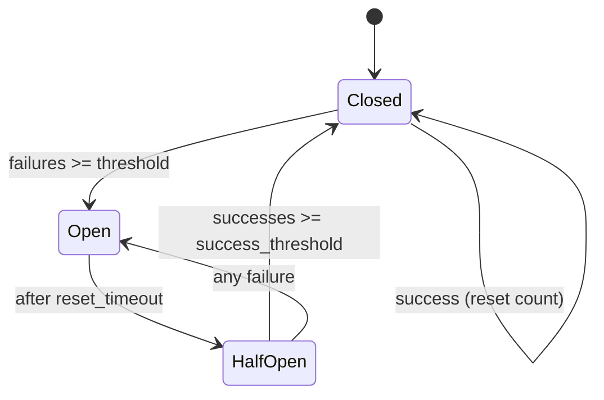
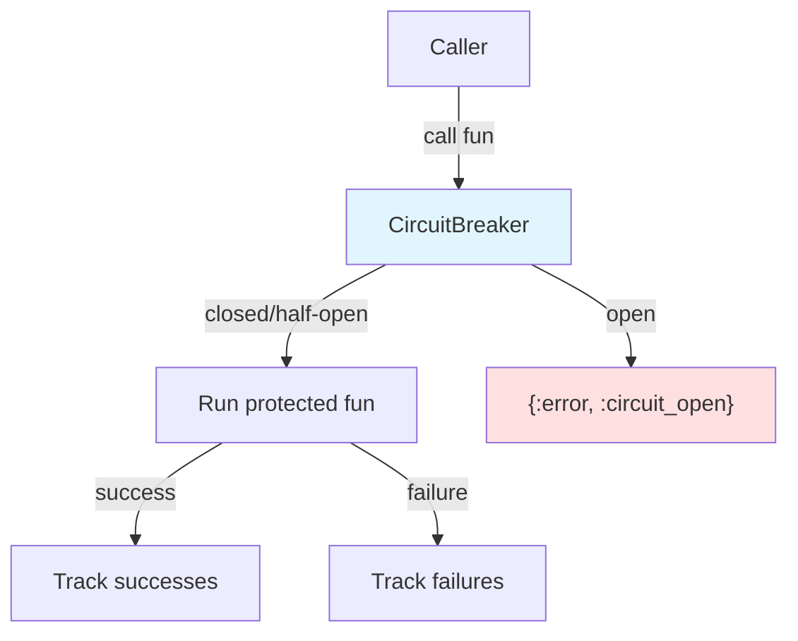

# Circuit Breaker Pattern

## Overview

The Circuit Breaker pattern protects an application from repeatedly calling a failing downstream service. Like an electrical circuit breaker, it "trips" when too many failures occur, then fails fast for a cooldown period instead of letting doomed requests pile up.

This gives the struggling service time to recover and prevents cascading failures from rippling through the system.

## Problem it Solves

- **Cascading failures**: Stop one failing dependency from taking down the whole system
- **Resource exhaustion**: Avoid tying up processes and connections waiting on a dead service
- **Slow recovery**: Give downstream services breathing room instead of hammering them
- **Fast failure**: Return errors immediately rather than after long timeouts

## When to Use

✅ **Good for:**

- Calls to external HTTP APIs and third-party services
- Database or cache connections that can become unavailable
- Any remote dependency with variable reliability
- Protecting expensive or slow operations under load

❌ **Avoid when:**

- The operation is purely local and cannot fail transiently
- Failures should always be retried immediately (use retry with backoff)
- You need request-level fallbacks rather than service-level protection (combine with fallbacks)

## The State Machine



| State | Behaviour |
|-------|-----------|
| **`:closed`** | Calls pass through. Consecutive failures count toward the threshold. |
| **`:open`** | Calls fail fast with `{:error, :circuit_open}`. A timer schedules recovery. |
| **`:half_open`** | Trial calls allowed. Successes close the breaker; any failure re-opens it. |

## How It Works



The protected function runs in an isolated, monitored process so that exceptions, exits, and timeouts are all captured as failures without crashing the caller.

## Implementation

### Tracking Failures

In the closed state, consecutive failures increment a counter. A success resets it:

```elixir
defp record_failure(%{circuit_state: :closed} = state) do
  failure_count = state.failure_count + 1
  state = %{state | failure_count: failure_count}

  if failure_count >= state.failure_threshold do
    to_open(state)
  else
    state
  end
end
```

### Tripping and Recovery

When tripping, schedule a timer to attempt recovery:

```elixir
defp to_open(state) do
  timer = Process.send_after(self(), :attempt_reset, state.reset_timeout)
  %{state | circuit_state: :open, open_timer: timer}
end

def handle_info(:attempt_reset, %{circuit_state: :open} = state) do
  {:noreply, to_half_open(state)}
end
```

### Isolated Execution

The wrapped function runs in a `spawn_monitor` process so failures never crash the caller:

```elixir
{pid, ref} = spawn_monitor(fn ->
  outcome =
    try do
      {:returned, fun.()}
    rescue
      e -> {:raised, e}
    end
  send(parent, {tag, outcome})
end)

receive do
  {^tag, {:returned, value}} -> report(value)
  {^tag, {:raised, e}} -> failure({:error, {:exception, e}})
  {:DOWN, ^ref, :process, ^pid, reason} -> failure({:error, {:exception, reason}})
after
  timeout -> failure({:error, :timeout})
end
```

## Usage Examples

### Basic Protection

```elixir
{:ok, breaker} = Patterns.CircuitBreaker.start_link(failure_threshold: 3)

result = Patterns.CircuitBreaker.call(breaker, fn ->
  HTTPClient.get("https://api.example.com/data")
end)

case result do
  {:ok, data} -> handle(data)
  {:error, :circuit_open} -> serve_cached_or_default()
  {:error, reason} -> log_and_fallback(reason)
end
```

### Configuration

```elixir
{:ok, breaker} =
  Patterns.CircuitBreaker.start_link(
    failure_threshold: 5,    # trip after 5 consecutive failures
    success_threshold: 2,    # close after 2 successes in half-open
    reset_timeout: 10_000,   # wait 10s before trialing recovery
    call_timeout: 3_000,     # treat calls slower than 3s as failures
    name: MyApp.PaymentBreaker
  )
```

### Custom Failure Classification

By default any `{:error, _}` or `:error` result counts as a failure. Override this for domain-specific results:

```elixir
predicate = fn
  {:ok, %{status: status}} when status >= 500 -> true
  _ -> false
end

{:ok, breaker} =
  Patterns.CircuitBreaker.start_link(failure_predicate: predicate)
```

### Introspection

```elixir
Patterns.CircuitBreaker.state(breaker)
# :closed | :open | :half_open

Patterns.CircuitBreaker.stats(breaker)
# %{
#   state: :closed,
#   failure_count: 0,
#   success_count: 0,
#   total_calls: 120,
#   total_failures: 7,
#   total_successes: 110,
#   total_rejected: 3
# }
```

### Manual Control

```elixir
Patterns.CircuitBreaker.trip(breaker)   # force open (e.g. maintenance)
Patterns.CircuitBreaker.reset(breaker)  # force closed
```

## Real-World Applications

### External API Gateway

Wrap each downstream dependency in its own breaker so one slow API does not exhaust your request pool:

```elixir
Patterns.CircuitBreaker.call(payment_breaker, fn ->
  PaymentGateway.charge(card, amount)
end)
```

### Database Failover

Trip to a read replica or cached data when the primary database is unreachable.

### Graceful Degradation

When the breaker is open, return a degraded-but-functional response (cached data, default values) instead of an error page.

## Tuning Guidance

| Parameter | Lower value | Higher value |
|-----------|-------------|--------------|
| `failure_threshold` | Trips faster, more sensitive | Tolerates more transient errors |
| `reset_timeout` | Recovers faster, risks flapping | More cautious recovery |
| `success_threshold` | Closes faster after recovery | Requires more proof of health |
| `call_timeout` | Fails slow calls sooner | Tolerates slower responses |

## Comparison with Related Patterns

| Pattern | Purpose |
|---------|---------|
| **Circuit Breaker** | Stop calling a failing service entirely for a while |
| **Retry with backoff** | Re-attempt a failed call after a delay |
| **Process Pool** | Bound concurrency to a resource |
| **Bulkhead** | Isolate failures to a subset of resources |

Circuit breakers pair well with retries (retry within closed state) and fallbacks (serve alternatives when open).

## Supervision Considerations

- Run one breaker per protected dependency, supervised like any GenServer
- Use the `:name` option to register breakers for easy access across the app
- The breaker holds only counters and a timer, so it is cheap and crash-safe
- On restart the breaker starts closed — acceptable since fresh failures will re-trip it

## Performance Characteristics

- **Permission check**: O(1) GenServer call per request
- **Open rejection**: Immediate — no downstream call made
- **Isolation cost**: One short-lived process per protected call
- **Memory**: Constant — a handful of integer counters and one timer

## Testing Tips

1. Use small thresholds (`failure_threshold: 1`) and short `reset_timeout` for fast tests
2. The outcome is reported via an async cast — make a synchronous `state/1` call before asserting
3. Test each transition: closed→open, open→half-open, half-open→closed, half-open→open
4. Verify exceptions and timeouts are counted as failures
5. Exercise custom failure predicates for domain-specific results

## Key Takeaways

1. **Three states, clear transitions** — closed, open, and half-open form a small, predictable state machine
2. **Fail fast when open** — the whole point is to stop calling a service that is down
3. **Half-open trials recovery** — probe cautiously before fully closing again
4. **Isolate the protected call** — capture exceptions, exits, and timeouts as failures without crashing the caller
5. **One breaker per dependency** — isolate failures so a single bad service does not sink the system

## Phase 2 Complete

With the circuit breaker, the Process Patterns phase is finished:

- Registry & Dynamic Supervisors
- Pub/Sub with Registry
- Process Pooling
- Circuit Breaker
