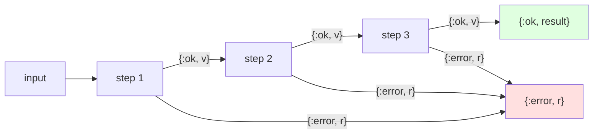

# Pipeline with `with` Chains

## Overview

A pipeline threads a value through a sequence of steps. Each step either
succeeds and passes its result to the next step, or fails and aborts the rest of
the pipeline. Elixir's `with` special form is purpose-built for this: it keeps
the **happy path linear and readable** while still handling the first failure
cleanly.

This is the gateway pattern into "railway-oriented programming" — the idea that
code runs on a success track until something fails, at which point it switches to
the error track and skips the remaining steps.

## Problem it Solves

- **Nested `case` pyramids**: Replace deeply indented `case`/`case`/`case` with a
  flat, top-to-bottom chain.
- **Lost error context**: Return the *first* meaningful `{:error, reason}` instead
  of a generic failure.
- **Mixed concerns**: Separate the happy path from error normalization.
- **Repetition**: Compose small, individually testable steps.

## When to Use

✅ **Good for:**

- Multi-step validation and normalization (params, config, payloads)
- Sequential operations where any step can fail (parse → validate → persist)
- Functions that today are a tower of nested `case` statements
- Any flow that should stop at the first error and report it

❌ **Avoid when:**

- Steps are independent and should all run regardless of failures (collect errors
  instead, e.g. with `Enum`/changesets)
- There is only a single fallible operation (a plain `case` is clearer)
- You need to accumulate *multiple* errors rather than short-circuit on the first

## The Core Idea

`with` matches each expression against a pattern. As long as the patterns match,
it keeps going and evaluates the `do` block. The moment a pattern fails to match,
`with` returns the non-matching value (or runs the `else` clause).



## How It Works

### A Concrete `with` Chain

The idiomatic form inside a single function — each clause guards the next:

```elixir
def register_user(params) do
  with {:ok, params} <- require_keys(params, [:email, :password, :age]),
       {:ok, email} <- validate_email(params.email),
       :ok <- validate_password(params.password),
       {:ok, age} <- validate_age(params.age) do
    {:ok, %{email: email, age: age, status: :active}}
  end
end
```

If every step matches, the `do` block runs. If `validate_email/1` returns
`{:error, :invalid_email}`, that value is returned immediately and the password
and age checks never run.

### Normalizing Errors with `else`

The `else` clause runs only when a `<-` pattern fails. Use it to translate
internal reasons into a stable external contract:

```elixir
def register_user_normalized(params) do
  with {:ok, params} <- require_keys(params, [:email, :password, :age]),
       {:ok, email} <- validate_email(params.email),
       :ok <- validate_password(params.password),
       {:ok, age} <- validate_age(params.age) do
    {:ok, %{email: email, age: age, status: :active}}
  else
    {:error, reason} -> {:error, describe(reason)}
  end
end
```

> **Watch out:** when you add an `else` clause, `with` no longer returns the
> unmatched value automatically — your `else` must handle *every* shape a step
> can return, or you'll get a `WithClauseError`.

### A Generic, Data-Driven Runner

When steps are configured at runtime or shared across call sites, fold a list of
step functions instead of hard-coding the chain:

```elixir
def run(input, steps) when is_list(steps) do
  Enum.reduce_while(steps, {:ok, input}, fn step, {:ok, value} ->
    case step.(value) do
      {:ok, _next} = ok -> {:cont, ok}
      {:error, _reason} = error -> {:halt, error}
      other -> {:halt, {:error, {:bad_step_return, other}}}
    end
  end)
end
```

`run_tagged/2` extends this by pairing each step with a tag, so failures come
back as `{:error, {tag, reason}}` and you always know *which* step failed.

## Usage Examples

### Inline Validation Pipeline

```elixir
Patterns.Pipeline.register_user(%{email: "JANE@EXAMPLE.COM", password: "hunter2!", age: 42})
# {:ok, %{email: "jane@example.com", age: 42, status: :active}}

Patterns.Pipeline.register_user(%{email: "nope", password: "hunter2!", age: 42})
# {:error, :invalid_email}
```

### Composable Step List

```elixir
Patterns.Pipeline.run("  Hello  ", [
  &{:ok, String.trim(&1)},
  &{:ok, String.downcase(&1)},
  &{:ok, String.replace(&1, " ", "-")}
])
# {:ok, "hello"}
```

### Tagged Steps for Debuggable Errors

```elixir
Patterns.Pipeline.run_tagged(0, [
  {:parse, fn n -> {:ok, n} end},
  {:positive?, fn n -> if n > 0, do: {:ok, n}, else: {:error, :non_positive} end}
])
# {:error, {:positive?, :non_positive}}
```

## Real-World Applications

### Request Handling

Parse → authenticate → authorize → validate → execute. Each layer can reject the
request, and `with` returns the first rejection without running the rest.

### ETL Steps

Extract → transform → load. A bad row short-circuits to an error that names the
failing stage.

### Config Loading

Read file → decode → validate schema → apply defaults. Surface the first problem
with a clear reason instead of a stack trace.

## `with` vs. Alternatives

| Approach | Best for |
|----------|----------|
| **`with` chain** | Sequential fallible steps, stop at first error |
| **Nested `case`** | A single branch with no follow-up steps |
| **Pipe `\|>`** | Steps that always succeed (no error track) |
| **`Enum.reduce_while`** | Runtime-configured or dynamic step lists |
| **Changesets / error accumulation** | Collecting *all* validation errors at once |

The pipe operator and `with` are complementary: `|>` chains plain transformations,
while `with` chains transformations that can fail.

## Design Notes

- **Keep steps small and pure.** Each step is independently testable and returns a
  tagged tuple, which is what makes them composable.
- **Be consistent with return shapes.** Steps here return `{:ok, value}`,
  `{:error, reason}`, or bare `:ok`. `with` matches whatever pattern you write, so
  pick a convention and stick to it.
- **Reach for `else` only when you need it.** Without `else`, `with` transparently
  returns the first non-matching value — often exactly what you want.
- **Tag failures when steps are generic.** `run_tagged/2` shows how to retain the
  "which step failed" context that an inline chain gets for free from distinct
  return reasons.

## Testing Tips

1. Test each step in isolation — they are plain functions with tagged returns.
2. Assert that the pipeline **short-circuits**: put a `flunk/1` in a later step and
   confirm it never runs after an error.
3. Cover the empty-pipeline case (`run/2` returns `{:ok, input}`).
4. Exercise the `else` normalization separately from the happy path.
5. Verify malformed step returns are wrapped rather than crashing.

## Key Takeaways

1. **`with` linearizes fallible sequences** — no more nested `case` pyramids.
2. **First error wins** — the chain short-circuits and returns the failing value.
3. **`else` normalizes failures** — but then it must handle every shape.
4. **Generic runners** — fold step functions when the chain is dynamic.
5. **Tag your steps** — keep "which step failed" visible for debugging.

## Phase 3 Progress

This is the first pattern in **Phase 3 — Functional Patterns**:

- ✅ Pipeline with `with` chains
- ⏳ Railway-oriented programming
- ⏳ Behaviour & Protocol systems
- ⏳ ETS-backed stores
