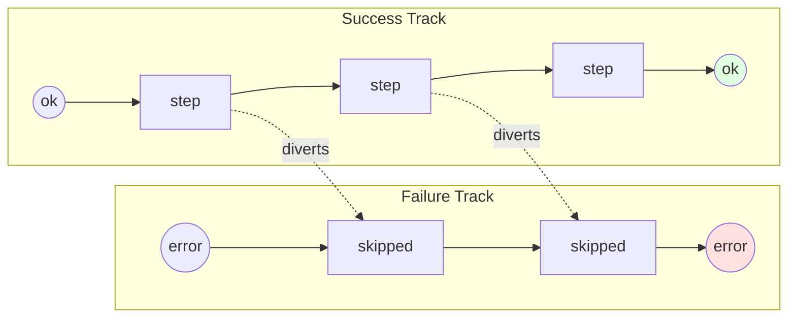

# Railway-Oriented Programming

## Overview

Railway-oriented programming (ROP) models a fallible computation as a **two-track
railway**. The *success track* carries `{:ok, value}`; the *failure track* carries
`{:error, reason}`. Each step is a switch in the track: while the train is on the
success track a step runs and may divert it to the failure track. Once on the
failure track, every remaining step is skipped and the error rides straight to the
end.

This is the same idea as the [Pipeline with `with` chains](09_pipeline_with.md)
pattern, expressed differently. Instead of the `with` special form, ROP provides a
set of **combinators** that thread a result through the pipe operator (`|>`), so a
pipeline reads as a series of small, reusable functions.

## Problem it Solves

- **Repetitive error plumbing**: Stop manually unwrapping `{:ok, _}` between every
  step.
- **Pipe-unfriendly results**: Plain `|>` chains break the moment a step can fail —
  ROP combinators make tagged tuples flow naturally through pipes.
- **Mixed transformation styles**: Compose steps that return results (`bind`), steps
  that return plain values (`map`), side effects (`tee`), and raising code
  (`try_catch`) in one chain.
- **Scattered recovery**: Centralize fallbacks (`recover`) and error normalization
  (`map_error`) instead of sprinkling `case` everywhere.

## When to Use

✅ **Good for:**

- Pipelines built with `|>` where any step can fail
- Reusable, composable steps shared across call sites
- Mixing pure transforms, side effects, and recovery in one flow
- Bringing raising or legacy code onto a result-based railway

❌ **Avoid when:**

- A single `with` chain inside one function reads more clearly (see Pipeline guide)
- You need to accumulate *all* errors rather than stop at the first
- The flow has no failure track at all (a plain `|>` chain is simpler)

## The Two Tracks



## The Combinators

| Function | On `{:ok, v}` | On `{:error, r}` | Step returns |
|----------|---------------|------------------|--------------|
| `bind/2` | runs `fun.(v)` | passes through | a **result** |
| `map/2` | wraps `fun.(v)` in `{:ok, _}` | passes through | a **plain value** |
| `map_error/2` | passes through | wraps `fun.(r)` in `{:error, _}` | a **plain reason** |
| `tee/2` | runs `fun.(v)`, returns input | passes through | ignored (side effect) |
| `tap_error/2` | passes through | runs `fun.(r)`, returns input | ignored (side effect) |
| `try_catch/2` | runs `fun.(v)`, rescues raises | passes through | a **plain value (may raise)** |
| `recover/2` | passes through | runs `fun.(r)` to switch back | a **result** |
| `unwrap/2` | returns `v` | returns the default | — (leaves the railway) |
| `unwrap_with/2` | returns `v` | returns `fun.(r)` | — (leaves the railway) |

### `bind` vs. `map`

This is the key distinction:

- **`map/2`** is for steps that *can't* fail. The function returns a bare value and
  ROP re-wraps it in `{:ok, _}`.
- **`bind/2`** is for steps that *can* fail. The function returns a full
  `{:ok, _}` / `{:error, _}` result and decides which track to continue on.

```elixir
# map: pure transformation, stays on the success track
{:ok, 3} |> Railway.map(&(&1 * 10))            # => {:ok, 30}

# bind: may divert to the failure track
{:ok, 3} |> Railway.bind(fn n ->
  if n > 0, do: {:ok, n}, else: {:error, :non_positive}
end)                                           # => {:ok, 3}
```

## Usage Examples

### A Full Pipeline

```elixir
alias Patterns.Railway

"  10 "
|> Railway.ok()
|> Railway.map(&String.trim/1)
|> Railway.try_catch(&String.to_integer/1)
|> Railway.bind(fn n -> if n > 0, do: {:ok, n}, else: {:error, :non_positive} end)
|> Railway.map(&(&1 * 2))
# => {:ok, 20}
```

### Short-Circuit, Log, and Recover

```elixir
"0"
|> Railway.ok()
|> Railway.try_catch(&String.to_integer/1)
|> Railway.bind(fn n -> if n > 0, do: {:ok, n}, else: {:error, :non_positive} end)
|> Railway.map(&expensive_step/1)            # skipped — we're on the failure track
|> Railway.tap_error(&Logger.warning("rejected: #{inspect(&1)}"))
|> Railway.recover(fn _ -> {:ok, :fallback} end)
# => {:ok, :fallback}
```

### Normalize Errors, Then Leave the Railway

```elixir
"not-a-number"
|> Railway.ok()
|> Railway.try_catch(&String.to_integer/1)
|> Railway.map_error(fn {:exception, _} -> :parse_failed end)
|> Railway.unwrap(0)
# => 0
```

## Real-World Applications

### Request Handling

```elixir
conn
|> Railway.ok()
|> Railway.bind(&authenticate/1)
|> Railway.bind(&authorize/1)
|> Railway.bind(&validate_params/1)
|> Railway.bind(&execute/1)
|> Railway.tap_error(&log_rejection/1)
|> Railway.unwrap_with(&error_response/1)
```

### External Calls

Bring an HTTP client onto the railway with `try_catch`, normalize transport errors
with `map_error`, and serve cached data with `recover` when the call fails.

### Data Import

Parse → validate → transform → persist, each as a `bind` step, with `tee` for
metrics and `recover` for per-record fallbacks.

## ROP vs. `with`

| | `with` chain (Pipeline) | ROP combinators (Railway) |
|---|---|---|
| **Syntax** | `with ... <- ... do` | `|>` pipeline of functions |
| **Best for** | one cohesive function | reusable, composable steps |
| **Side effects** | inline expressions | explicit `tee` / `tap_error` |
| **Recovery** | `else` clause | `recover` / `map_error` |
| **Readability** | great for a fixed sequence | great for shared building blocks |

They are two views of the same railway — pick whichever reads more clearly for the
flow at hand. Many codebases use both.

## Design Notes

- **Keep `map` pure.** If a transform can fail, it belongs in `bind`, not `map`.
- **Make side effects explicit.** `tee` and `tap_error` signal "this changes the
  world, not the value", which keeps the data flow honest.
- **Quarantine raises at the edges.** Wrap raising/legacy code in `try_catch` once,
  then stay on tagged tuples for the rest of the chain.
- **Recover late, normalize early.** Use `map_error` near the failure source to give
  reasons meaning, and `recover` near the end to decide a fallback.

## Testing Tips

1. Test each combinator on both tracks — success passes through, failure short-circuits.
2. Put a `flunk/1` inside a step that should be skipped to prove short-circuiting.
3. Use `send(self(), ...)` + `assert_received` to verify `tee` / `tap_error` fire
   exactly when expected.
4. Assert that `try_catch` converts a raise into `{:error, {:exception, _}}`.
5. Cover `recover` switching the train back onto the success track.

## Key Takeaways

1. **Two tracks, one pipeline** — success and failure flow through the same `|>` chain.
2. **`bind` for fallible, `map` for pure** — the most important distinction.
3. **Errors skip the rest** — once on the failure track, steps are bypassed.
4. **Side effects are explicit** — `tee` and `tap_error` never change the result.
5. **Recover and unwrap leave the railway** — switch back or extract a final value.

## Phase 3 Progress

Second pattern in **Phase 3 — Functional Patterns**:

- ✅ Pipeline with `with` chains
- ✅ Railway-oriented programming
- ⏳ Behaviour & Protocol systems
- ⏳ ETS-backed stores
